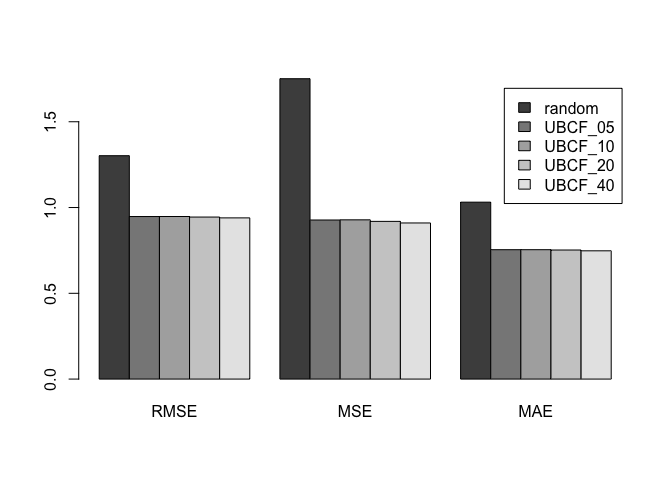
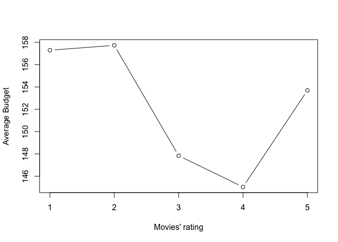

In this case, we will develop a movies recommender by collaborative filtering with recommenderlab. The datasets allow us to take a deeper look at data-driven movie recommendations. (Data comes from  https://www.kaggle.com/rounakbanik/the-movies-dataset)

Here we use collaborative filtering to build the recommender system, because it is target on per user, it is more customized and specifically. If we use clustering or association rules to build the recommender system, it won't be "individual" specific, may lead to low utility recommendations.

## 1. Read in data

First, let's have a look at the dataset. It contains 2 files: ratings_small.csv and movies_metadata.csv, and these 2 files are linked by the movie ID.


```r
ratings<- read.csv("ratings_small.csv")
movies<- read.csv("movies_metadata.csv")
colnames(movies)[colnames(movies)=="id"]<- "movieId"
movies$movieId<- as.integer(movies$movieId)
head(ratings,1)
```

```
##   userId movieId rating  timestamp
## 1      1      31    2.5 1260759144
```

```r
head(movies,1)
```

```
##   adult
## 1 False
##                                                                                                                                   belongs_to_collection
## 1 {'id': 10194, 'name': 'Toy Story Collection', 'poster_path': '/7G9915LfUQ2lVfwMEEhDsn3kT4B.jpg', 'backdrop_path': '/9FBwqcd9IRruEDUrTdcaafOMKUq.jpg'}
##     budget
## 1 30000000
##                                                                                             genres
## 1 [{'id': 16, 'name': 'Animation'}, {'id': 35, 'name': 'Comedy'}, {'id': 10751, 'name': 'Family'}]
##                               homepage movieId   imdb_id original_language
## 1 http://toystory.disney.com/toy-story   42818 tt0114709                en
##   original_title
## 1      Toy Story
##                                                                                                                                                                                                                                                                                                          overview
## 1 Led by Woody, Andy's toys live happily in his room until Andy's birthday brings Buzz Lightyear onto the scene. Afraid of losing his place in Andy's heart, Woody plots against Buzz. But when circumstances separate Buzz and Woody from their owner, the duo eventually learns to put aside their differences.
##   popularity                      poster_path
## 1  21.946943 /rhIRbceoE9lR4veEXuwCC2wARtG.jpg
##                             production_companies
## 1 [{'name': 'Pixar Animation Studios', 'id': 3}]
##                                         production_countries release_date
## 1 [{'iso_3166_1': 'US', 'name': 'United States of America'}]   1995-10-30
##     revenue runtime                         spoken_languages   status
## 1 373554033      81 [{'iso_639_1': 'en', 'name': 'English'}] Released
##   tagline     title video vote_average vote_count
## 1         Toy Story False          7.7       5415
```

## 2. Data pre-processing

For the collaborative filtering, it is better to have more ratings per user. So we decide to remove users who have rated fewer than 5 movies, but I find the minimum number of ratings per user is 20. So we can keep all the users.

Collaborative filtering is a standard method for product recommendations. For collaborative filtering, data are usually structured that each row corresponds to a user and each column corresponds to a movie. So we need to restructure our ratings data from this dataset in the same way.


```r
library(recommenderlab)
```

```
## Warning: package 'recommenderlab' was built under R version 3.4.4
```

```
## Loading required package: Matrix
```

```
## Loading required package: arules
```

```
## Warning: package 'arules' was built under R version 3.4.4
```

```
## 
## Attaching package: 'arules'
```

```
## The following objects are masked from 'package:base':
## 
##     abbreviate, write
```

```
## Loading required package: proxy
```

```
## Warning: package 'proxy' was built under R version 3.4.4
```

```
## 
## Attaching package: 'proxy'
```

```
## The following object is masked from 'package:Matrix':
## 
##     as.matrix
```

```
## The following objects are masked from 'package:stats':
## 
##     as.dist, dist
```

```
## The following object is masked from 'package:base':
## 
##     as.matrix
```

```
## Loading required package: registry
```

```
## Warning: package 'registry' was built under R version 3.4.3
```

```r
library(data.table)
```

```
## Warning: package 'data.table' was built under R version 3.4.4
```

```r
library(dplyr)
```

```
## Warning: package 'dplyr' was built under R version 3.4.4
```

```
## 
## Attaching package: 'dplyr'
```

```
## The following objects are masked from 'package:data.table':
## 
##     between, first, last
```

```
## The following objects are masked from 'package:arules':
## 
##     intersect, recode, setdiff, setequal, union
```

```
## The following objects are masked from 'package:stats':
## 
##     filter, lag
```

```
## The following objects are masked from 'package:base':
## 
##     intersect, setdiff, setequal, union
```

```r
library(tidyr)
```

```
## Warning: package 'tidyr' was built under R version 3.4.4
```

```
## 
## Attaching package: 'tidyr'
```

```
## The following object is masked from 'package:Matrix':
## 
##     expand
```

```r
library(DT)
```

```
## Warning: package 'DT' was built under R version 3.4.4
```

```r
library(knitr)
library(Matrix)

users<- unique(ratings$userId)
usernum<- data.frame(0)
for (i in 1:length(users)){
  usernum[i,1]<- i
  usernum[i,2]<- nrow(ratings[which(ratings$userId==i),])
}
min(usernum$V2)
```

```
## [1] 20
```

```r
# Reconstructure
matrix_names <- list(userId = sort(unique(ratings$userId)), movieId = sort(unique(ratings$movieId)))
ratingmat <- spread(select(ratings, movieId, userId, rating), movieId, rating) %>% select(-userId)
ratingmat <- as.matrix(ratingmat)
dimnames(ratingmat) <- matrix_names
ratingmat[1:10, 1:10]
```

```
##       movieId
## userId  1  2  3  4  5  6  7  8  9 10
##     1  NA NA NA NA NA NA NA NA NA NA
##     2  NA NA NA NA NA NA NA NA NA  4
##     3  NA NA NA NA NA NA NA NA NA NA
##     4  NA NA NA NA NA NA NA NA NA  4
##     5  NA NA  4 NA NA NA NA NA NA NA
##     6  NA NA NA NA NA NA NA NA NA NA
##     7   3 NA NA NA NA NA NA NA NA  3
##     8  NA NA NA NA NA NA NA NA NA NA
##     9   4 NA NA NA NA NA NA NA NA NA
##     10 NA NA NA NA NA NA NA NA NA NA
```

```r
dim(ratingmat)  # we have 671 users and 9066 movies
```

```
## [1]  671 9066
```

## 3. Collaborative Filtering 

We select one example user "Yuan" (userId: 18). We can see from the matrix above, because every user only rated small number of movies, most values in the matrix are missing values. We can represent the matrix in sparse format to save memory.

In this case, I decide to use user-based collaborative filtering method ("UBCF"), use "pearson" to calculate similarity and take 5 as the number of most similiar users used for predictions.


```r
example_user <- "18"
ratingmatsss <- ratingmat
ratingmatsss[is.na(ratingmatsss)] <- 0
sssratings <- as(ratingmatsss, "sparseMatrix")
rm(ratingmatsss)
real_ratings <- new("realRatingMatrix", data = sssratings)
real_ratings
```

```
## 671 x 9066 rating matrix of class 'realRatingMatrix' with 100004 ratings.
```

```r
# Build recommendation model
model <- Recommender(real_ratings, method = "UBCF", param = list(method = "pearson", nn = 5))
prediction <- predict(model, real_ratings[example_user, ], type = "ratings")
as(prediction, 'data.frame') %>% 
  arrange(-rating) %>% .[1:5,] %>% 
  mutate(movieId = as.numeric(as.character(item))) %>% 
  left_join(select(movies, movieId, original_title), by = "movieId") %>% 
  select(-item) %>% 
  datatable(class="nowrap hover row-border", escape = FALSE, options = list(dom = 't',scrollX = TRUE, autoWidth = FALSE))  
```

```
## Warning: package 'bindrcpp' was built under R version 3.4.4
```

```
## Warning in instance$preRenderHook(instance): It seems your data is too
## big for client-side DataTables. You may consider server-side processing:
## https://rstudio.github.io/DT/server.html
```

<!--html_preserve--><div id="htmlwidget-c29fe721f2daf11bdf98" style="width:100%;height:auto;" class="datatables html-widget"></div>
<script type="application/json" data-for="htmlwidget-c29fe721f2daf11bdf98">{"x":{"filter":"none","data":[["1","2","3","4","5"],["18","18","18","18","18"],[3.55326968483729,3.55326968483729,3.55326968483729,3.5129188076443,3.5129188076443],[527,2959,55820,1,110],["Trinità e Sartana figli di…","La voglia matta",null,"Lock, Stock and Two Smoking Barrels","The Three Musketeers"]],"container":"<table class=\"nowrap hover row-border\">\n  <thead>\n    <tr>\n      <th> <\/th>\n      <th>user<\/th>\n      <th>rating<\/th>\n      <th>movieId<\/th>\n      <th>original_title<\/th>\n    <\/tr>\n  <\/thead>\n<\/table>","options":{"dom":"t","scrollX":true,"autoWidth":false,"columnDefs":[{"className":"dt-right","targets":[2,3]},{"orderable":false,"targets":0}],"order":[],"orderClasses":false}},"evals":[],"jsHooks":[]}</script><!--/html_preserve-->

From table above, we can see the recommendations for "Yuan", they are movies 527, 2959, 55820, 1 and 110.

## 4. Prediction evaluation 

It is easy to evaluate and compare algorithms in  Recommenderlab. Here we will use 10-fold cross validition to evaluate the recommendation model. All the algorithms that we want to compare is RANDOM, and the "UBCF" which the nn varies from 5 to 40.

It seems like UBCF is better than RANDOM. But when using UBCF, it does not have a significant difference when we choose different numbers to calculate the similarity.


```r
scheme <- evaluationScheme(real_ratings[1:100,], method = "cross-validation", k = 10, given = -1, goodRating = 5)
algorithms <- list("random" = list(name = "RANDOM", param = NULL),
                   "UBCF_05" = list(name = "UBCF", param = list(nn = 5)),
                   "UBCF_10" = list(name = "UBCF", param = list(nn = 10)),
                   "UBCF_20" = list(name = "UBCF", param = list(nn = 20)),                   
                   "UBCF_40" = list(name = "UBCF", param = list(nn = 40))
                   )
results <- evaluate(scheme, algorithms, type = "ratings")
```

```
## RANDOM run fold/sample [model time/prediction time]
## 	 1  [0.001sec/0.05sec] 
## 	 2  [0.018sec/0.04sec] 
## 	 3  [0.001sec/0.062sec] 
## 	 4  [0.001sec/0.042sec] 
## 	 5  [0.001sec/0.062sec] 
## 	 6  [0sec/0.041sec] 
## 	 7  [0.001sec/0.044sec] 
## 	 8  [0.001sec/0.042sec] 
## 	 9  [0.001sec/0.042sec] 
## 	 10  [0.001sec/0.062sec] 
## UBCF run fold/sample [model time/prediction time]
## 	 1  [0.024sec/0.203sec] 
## 	 2  [0.003sec/0.258sec] 
## 	 3  [0.003sec/0.177sec] 
## 	 4  [0.003sec/0.18sec] 
## 	 5  [0.003sec/0.2sec] 
## 	 6  [0.003sec/0.179sec] 
## 	 7  [0.003sec/0.181sec] 
## 	 8  [0.003sec/0.18sec] 
## 	 9  [0.003sec/0.182sec] 
## 	 10  [0.003sec/0.177sec] 
## UBCF run fold/sample [model time/prediction time]
## 	 1  [0.003sec/0.408sec] 
## 	 2  [0.003sec/0.149sec] 
## 	 3  [0.005sec/0.152sec] 
## 	 4  [0.003sec/0.181sec] 
## 	 5  [0.003sec/0.154sec] 
## 	 6  [0.003sec/0.183sec] 
## 	 7  [0.003sec/0.161sec] 
## 	 8  [0.005sec/0.148sec] 
## 	 9  [0.006sec/0.188sec] 
## 	 10  [0.003sec/0.148sec] 
## UBCF run fold/sample [model time/prediction time]
## 	 1  [0.005sec/0.152sec] 
## 	 2  [0.003sec/0.148sec] 
## 	 3  [0.004sec/0.146sec] 
## 	 4  [0.003sec/0.19sec] 
## 	 5  [0.003sec/0.153sec] 
## 	 6  [0.002sec/0.154sec] 
## 	 7  [0.003sec/0.184sec] 
## 	 8  [0.003sec/0.146sec] 
## 	 9  [0.003sec/0.149sec] 
## 	 10  [0.004sec/0.181sec] 
## UBCF run fold/sample [model time/prediction time]
## 	 1  [0.003sec/0.144sec] 
## 	 2  [0.004sec/0.179sec] 
## 	 3  [0.003sec/0.149sec] 
## 	 4  [0.003sec/0.152sec] 
## 	 5  [0.006sec/0.171sec] 
## 	 6  [0.003sec/0.151sec] 
## 	 7  [0.003sec/0.178sec] 
## 	 8  [0.003sec/0.149sec] 
## 	 9  [0.003sec/0.173sec] 
## 	 10  [0.003sec/0.145sec]
```

```r
plot(results, annotate = 1:4, legend="topleft")
```

<!-- -->

## 5. Further interesting fact

By ploting Budget Vs. Rating, we find an intersting fact. Movies with 1 or 2 star usually spend more money than the movies with 5 star, money is not equal to success.


```r
# Divide all movies into five levels
rate1<- unique(ratings[which(ratings$rating<=1),2])
rate2<- unique(ratings[which(ratings$rating<=2 & ratings$rating>1),2])
rate3<- unique(ratings[which(ratings$rating<=3 & ratings$rating>2),2])
rate4<- unique(ratings[which(ratings$rating<=4 & ratings$rating>3),2])
rate5<- unique(ratings[which(ratings$rating<=5 & ratings$rating>4),2])

movies$budget<- as.numeric(movies$budget)
c<- c(mean(movies[which(movies$movieId %in% rate1),3]),mean(movies[which(movies$movieId %in% rate2),3]),mean(movies[which(movies$movieId %in% rate3),3]),mean(movies[which(movies$movieId %in% rate4),3]),mean(movies[which(movies$movieId %in% rate5),3]))
plot(c, type="b", xlab="Movies' rating", ylab="Average Budget")
```

<!-- -->
