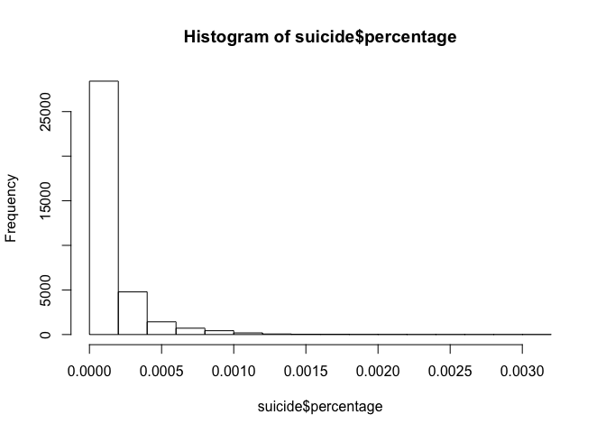
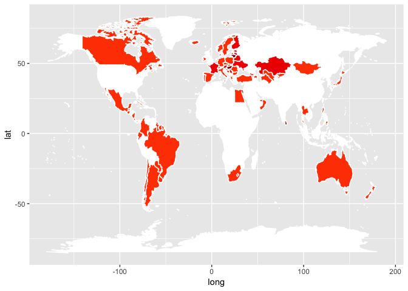
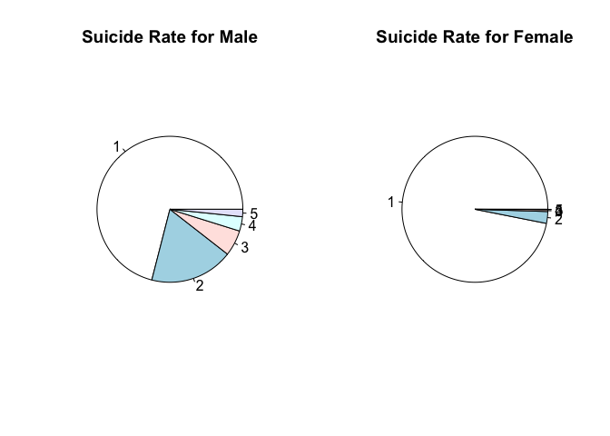
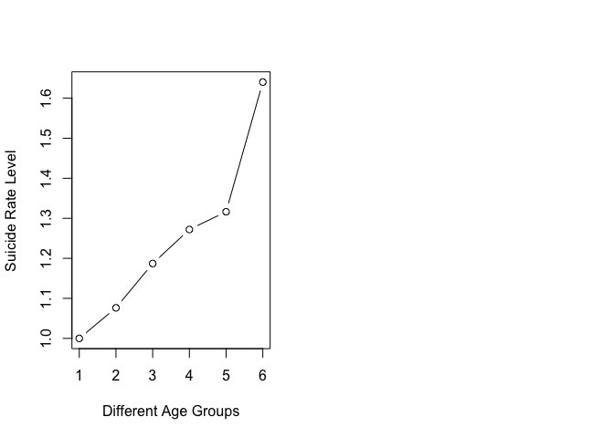

In this case, we will apply association rule to a dataset containing the "suicide" data, to find out what type of people have the highest probability to suicide. 

The dataset is the basic historical (1979-2016) data by country, year and demographic groups. Number of suicides and population are measured in people, so 1 simply means one person, not one thousand etc. (Data comes from https://www.kaggle.com/szamil/who-suicide-statistics)

##1. Read in data


```r
suicide<- read.csv("who_suicide_statistics.csv")
```

##2. Data pre-processing

First we need to remove 7716 missing values. 


```r
sum(is.na(suicide[,1:6]))
```

```
## [1] 7716
```

```r
suicide<- suicide[complete.cases(suicide),]
```

By looking into the data, for "suicides_no" and "population", these two variables are integer and have a wide range (many different levels). Based on this situation, we need to create a new clumn, the percentage of suicide. By looking into the distribution of percentage numbers, we create a column (indicator) to indicate the level of percentage numbers, so we can apply association rule to the dataset. The indicator columns scale from 1 to 5, 1 is the lowest percentage, 5 is the highest.


```r
str(suicide)
```

```
## 'data.frame':	36060 obs. of  6 variables:
##  $ country    : Factor w/ 141 levels "Albania","Anguilla",..: 1 1 1 1 1 1 1 1 1 1 ...
##  $ year       : int  1987 1987 1987 1987 1987 1987 1987 1987 1987 1987 ...
##  $ sex        : Factor w/ 2 levels "female","male": 1 1 1 1 1 1 2 2 2 2 ...
##  $ age        : Factor w/ 6 levels "15-24 years",..: 1 2 3 4 5 6 1 2 3 4 ...
##  $ suicides_no: int  14 4 6 0 0 1 21 9 16 0 ...
##  $ population : int  289700 257200 278800 311000 144600 35600 312900 274300 308000 338200 ...
```

```r
suicide$percentage<- suicide$suicides_no/suicide$population
hist(suicide$percentage)
```

<!-- -->

```r
suicide$rank<- ifelse(suicide$percentage> 0.0010,5,0)
suicide$rank<- ifelse(suicide$percentage<= 0.0010,4,suicide$rank)
suicide$rank<- ifelse(suicide$percentage<= 0.00075,3,suicide$rank)
suicide$rank<- ifelse(suicide$percentage<= 0.0005,2,suicide$rank)
suicide$rank<- ifelse(suicide$percentage<= 0.00025,1,suicide$rank)
```


##3. Association rule analysis

Before using the package "arules", we need to convert the dataset into transactions format. Once we get all rules, redundant rules need to be removed.


```r
library("arules")
```

```
## Warning: package 'arules' was built under R version 3.4.4
```

```
## Loading required package: Matrix
```

```
## 
## Attaching package: 'arules'
```

```
## The following objects are masked from 'package:base':
## 
##     abbreviate, write
```

```r
forrule<- suicide   # the dataset we will use to apply association rule analysis
forrule$suicides_no<- NULL
forrule$population<- NULL
forrule$percentage<- NULL
forrule$year<- as.factor(forrule$year)
forrule$rank<- as.factor(forrule$rank)
forrule<- as.data.frame(forrule)
trans<- as(forrule,"transactions")

rules<- apriori(trans ,parameter = list(support=0.0005, confidence=0.5, minlen=2,target="rules"))
```

```
## Apriori
## 
## Parameter specification:
##  confidence minval smax arem  aval originalSupport maxtime support minlen
##         0.5    0.1    1 none FALSE            TRUE       5   5e-04      2
##  maxlen target   ext
##      10  rules FALSE
## 
## Algorithmic control:
##  filter tree heap memopt load sort verbose
##     0.1 TRUE TRUE  FALSE TRUE    2    TRUE
## 
## Absolute minimum support count: 18 
## 
## set item appearances ...[0 item(s)] done [0.00s].
## set transactions ...[169 item(s), 36060 transaction(s)] done [0.01s].
## sorting and recoding items ... [165 item(s)] done [0.00s].
## creating transaction tree ... done [0.01s].
## checking subsets of size 1 2 3 4 done [0.01s].
## writing ... [5963 rule(s)] done [0.00s].
## creating S4 object  ... done [0.01s].
```

```r
#inspect(sort(rules, by="lift",decreasing = TRUE)[1:5])
rmredundant_rules<- rules[!is.redundant(rules)]
inspect(sort(rmredundant_rules, by="lift",decreasing = TRUE)[1:5])
```

```
##     lhs                             rhs           support confidence     lift count
## [1] {country=Hungary,                                                              
##      sex=male,                                                                     
##      age=75+ years}              => {rank=5} 0.0008596783  0.8157895 98.38585    31
## [2] {country=Slovenia,                                                             
##      sex=male,                                                                     
##      age=75+ years}              => {rank=5} 0.0006378258  0.7419355 89.47891    23
## [3] {country=Lithuania,                                                            
##      sex=male,                                                                     
##      age=75+ years}              => {rank=4} 0.0006378258  0.6764706 41.34497    23
## [4] {country=Russian Federation,                                                   
##      sex=male,                                                                     
##      age=75+ years}              => {rank=4} 0.0005823627  0.6176471 37.74975    21
## [5] {country=Uruguay,                                                              
##      sex=male,                                                                     
##      age=75+ years}              => {rank=4} 0.0005268996  0.5757576 35.18952    19
```
From rules we found above, for 75+ years old male living in Hungary and Slovenia, we are approximately 80% sure that they have the highest suicide rate. The lifts are 89 and 98, it means {country=Hungary,sex=male,age=75+ years}/{country=Slovenia,sex=male,age=75+ years} and {rank=5} are dependent on each other, they are found together 89/98 times more often than what would be expected by chance (i.e. if people suicide at random).

For 75+ years old male living in Lithuania, Russian Federation and Uruguay, we are approximately 60% sure that they have the second highest suicide rate. The lifts are all about  40, it means {country=Lithuania,sex=male,age=75+ years}/{country=Russian Federation,sex=male,age=75+ years}/{country=Uruguay,sex=male,age=75+ years} and {rank=4} are dependent on each other, they are found together approximately 40 times more often than what would be expected by chance (i.e. if people suicide at random).


##4. Futher insights

To dig deeper into the countries, we find the countries with high suicide rate are in Europe and Asia. Just like the map below, the color means the level of suicide rate. The darker the color, the higher the suicide rate.


```r
library("maps")
```

```
## Warning: package 'maps' was built under R version 3.4.4
```

```r
library("ggplot2")
```

```
## Warning: package 'ggplot2' was built under R version 3.4.4
```

```r
country<- as.character(unique(suicide$country))
rank_country<- data.frame(0)
for (i in 1:length(country)){
  rank_country[i,1]<- country[i]
  a<- suicide[which(suicide$country==country[i]),8]
  rank_country[i,2]<- mean(a)
}

all_countries<- map_data("world")
p<- ggplot()
p <- p + geom_polygon( data=all_countries, aes(x=long, y=lat, group = group),colour="white", fill="white" )


low<- as.factor(rank_country[which(rank_country$V2< 1.5),1])
med<- as.factor(rank_country[which(rank_country$V2< 2 &  rank_country$V2>= 1.5),1])
high<- as.factor(rank_country[which(rank_country$V2>= 2),1])
aaa <- subset(all_countries, region %in% low)
p <- p + geom_polygon( data=aaa, aes(x=long, y=lat, group = group),colour="white", fill="orangered" )
bbb<- subset(all_countries, region %in% med)
p <- p + geom_polygon( data=bbb, aes(x=long, y=lat, group = group),colour="white", fill="red2" )
ccc<- subset(all_countries, region %in% high)
(p <- p + geom_polygon( data=ccc, aes(x=long, y=lat, group = group),colour="white", fill="red4" ))
```

<!-- -->

To dig deeper into the sex and age, we find male has a higher suicide rate. As age is increasing, the suicide rate is also increasing. Especially, in the age group 75 years+, the suicide rate increases dramatically.


```r
#for sex
male.rank<- suicide[which(suicide$sex=="male"),8]
male.pie<- c()
for (i in 1:5){
  male.pie[i]<- length(which(male.rank==i))
}

female.rank<- suicide[which(suicide$sex=="female"),8]
female.pie<- c()
for (i in 1:5){
  female.pie[i]<- length(which(female.rank==i))
}

par(mfrow=c(1,2))
pie(male.pie, main = "Suicide Rate for Male")
pie(female.pie, main = "Suicide Rate for Female")
```

<!-- -->

```r
#for different age groups
years5_14<- mean(suicide[which(suicide$age=="5-14 years"),8])
years15_24<- mean(suicide[which(suicide$age=="15-24 years"),8])
years25_34<- mean(suicide[which(suicide$age=="25-34 years"),8])
years35_54<- mean(suicide[which(suicide$age=="35-54 years"),8])
years55_74<- mean(suicide[which(suicide$age=="55-74 years"),8])
years75<- mean(suicide[which(suicide$age=="75+ years"),8])
number<- c(years5_14,years15_24,years25_34,years35_54,years55_74,years75)
plot(number,xlab = "Different Age Groups",ylab = "Suicide Rate Level",type = "b")
```

<!-- -->
