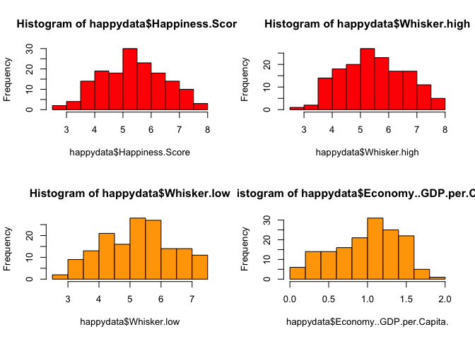
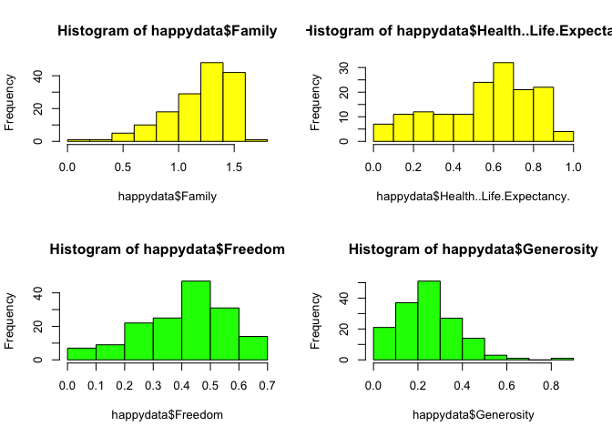
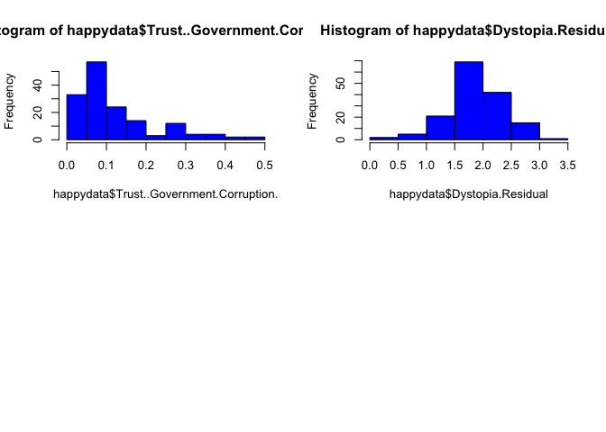
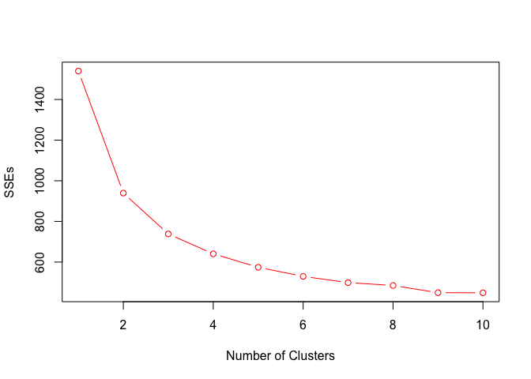
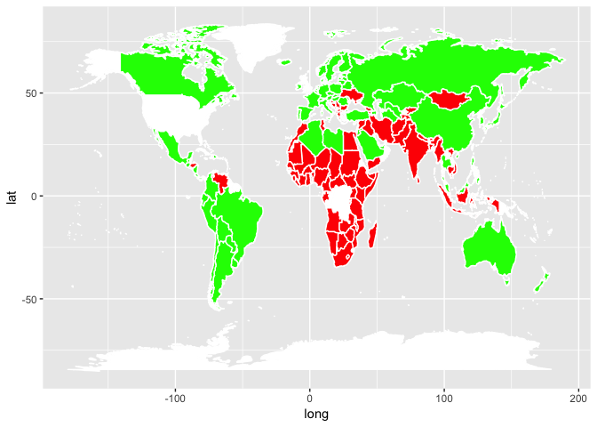

In this case, we will manipulate clustering analysis on World Happiness Report 2017, to find out the secret of being happiness.(Data comes from https://www.kaggle.com/unsdsn/world-happiness#2017.csv)

This dataset contains happiness rank and scores by country, 2017. The happiness scores is a metric measured in 2017 by asking the sampled people the question: "How would you rate your happiness on a scale of 0 to 10 where 10 is the happiest"

## 1. Read in data

First, we need to read data into work environment. 


```r
happydata<- read.csv("2017.csv")
head(happydata,2)
```

```
##   Country Happiness.Rank Happiness.Score Whisker.high Whisker.low
## 1  Norway              1           7.537     7.594445    7.479556
## 2 Denmark              2           7.522     7.581728    7.462272
##   Economy..GDP.per.Capita.   Family Health..Life.Expectancy.   Freedom
## 1                 1.616463 1.533524                0.7966665 0.6354226
## 2                 1.482383 1.551122                0.7925655 0.6260067
##   Generosity Trust..Government.Corruption. Dystopia.Residual
## 1  0.3620122                     0.3159638          2.277027
## 2  0.3552805                     0.4007701          2.313707
```

## 2. Exploratory Data Analysis

All variables are numeric besides the "Country" column, and there is no missing value in the dataset. 

By looking into histograms of all variables besides "Country" and "Happiness.Rank", it is clear that most variables follow the normal distribution, without the significant outlier.


```r
str(happydata)
```

```
## 'data.frame':	155 obs. of  12 variables:
##  $ Country                      : Factor w/ 155 levels "Afghanistan",..: 105 38 58 133 45 99 26 100 132 7 ...
##  $ Happiness.Rank               : int  1 2 3 4 5 6 7 8 9 10 ...
##  $ Happiness.Score              : num  7.54 7.52 7.5 7.49 7.47 ...
##  $ Whisker.high                 : num  7.59 7.58 7.62 7.56 7.53 ...
##  $ Whisker.low                  : num  7.48 7.46 7.39 7.43 7.41 ...
##  $ Economy..GDP.per.Capita.     : num  1.62 1.48 1.48 1.56 1.44 ...
##  $ Family                       : num  1.53 1.55 1.61 1.52 1.54 ...
##  $ Health..Life.Expectancy.     : num  0.797 0.793 0.834 0.858 0.809 ...
##  $ Freedom                      : num  0.635 0.626 0.627 0.62 0.618 ...
##  $ Generosity                   : num  0.362 0.355 0.476 0.291 0.245 ...
##  $ Trust..Government.Corruption.: num  0.316 0.401 0.154 0.367 0.383 ...
##  $ Dystopia.Residual            : num  2.28 2.31 2.32 2.28 2.43 ...
```

```r
table(is.na(happydata))
```

```
## 
## FALSE 
##  1860
```

```r
par(mfrow=c(2,2))
hist(happydata$Happiness.Score,col= "red");hist(happydata$Whisker.high, col = "red");hist(happydata$Whisker.low, col = "orange");hist(happydata$Economy..GDP.per.Capita., col = "orange");hist(happydata$Family,col = "yellow");hist(happydata$Health..Life.Expectancy.,col = "yellow");hist(happydata$Freedom,col = "green");hist(happydata$Generosity, col = "green");hist(happydata$Trust..Government.Corruption.,col = "blue");hist(happydata$Dystopia.Residual, col = "blue")
```

<!-- --><!-- --><!-- -->


## 3. Discussion of the chosen clustering method

By applying clustering analysis to this dataset, we will find countries in the same group will be similiar (or related) to one another and different from (or unrelated to) the countries in other groups. In this way, we can reduce the size of large data sets and focus on the signals rather than noise.

For this case, I will use K-means clustering method. For hierarchical clustering and DBScan, they are resistent to noise and outliers, but this data does not have noticeable noise or outlier, also DBScan is not suitable for high-dimentional data. So K-means is a better method for this case, not only because nearly every variable follows normal distribution, but also all variables have same densities.

## 4. K-means clustering & results

Before applying K-means clustering analysis, we need to normalize the dataset. Because all the variables are not in the same range, if we don't normalize the dataset first, the distance would be wrongly calculated, and the variable with the largest scale will dominate the cluster result.


```r
scalehappy<- scale(happydata[,3:12])
fit<- kmeans(scalehappy,3)
set.seed(100)
SSEs<- rep(NA,10)
SSEs[1]<- fit$totss
for(k in 2:10){
  fit<- kmeans(scalehappy,k)
  SSEs[k]<- fit$tot.withinss
}
plot(1:10,SSEs,type = "b",xlab = "Number of Clusters", col="red")
```

<!-- -->

```r
fit<- kmeans(scalehappy,2)
fit$size
```

```
## [1] 76 79
```

From the graph above, we can see the "elbow" when the number of clusters is 2. So we divided all the countries into 2 clusters. Cluster 1 has 76 countries, cluster 2 has 79 countries. 


```r
happydata$cluster<- fit$cluster
summary(happydata[which(happydata$cluster==1),3:13])[3,]
```

```
##               Happiness.Score                  Whisker.high 
##             "Median :4.481  "             "Median :4.579  " 
##                   Whisker.low      Economy..GDP.per.Capita. 
##             "Median :4.372  "            "Median :0.6540  " 
##                        Family      Health..Life.Expectancy. 
##            "Median :1.0247  "            "Median :0.3605  " 
##                       Freedom                    Generosity 
##            "Median :0.3422  "            "Median :0.2362  " 
## Trust..Government.Corruption.             Dystopia.Residual 
##           "Median :0.07485  "            "Median :1.6911  " 
##                       cluster 
##                 "Median :1  "
```

```r
summary(happydata[which(happydata$cluster==2),3:13])[3,]
```

```
##               Happiness.Score                  Whisker.high 
##             "Median :6.098  "             "Median :6.192  " 
##                   Whisker.low      Economy..GDP.per.Capita. 
##             "Median :5.995  "            "Median :1.3152  " 
##                        Family      Health..Life.Expectancy. 
##             "Median :1.402  "            "Median :0.7100  " 
##                       Freedom                    Generosity 
##            "Median :0.4912  "           "Median :0.22556  " 
## Trust..Government.Corruption.             Dystopia.Residual 
##          "Median :0.119283  "            "Median :2.0395  " 
##                       cluster 
##                 "Median :2  "
```
Here, we tried to give each cluster a label, cluster 1 is "unhappy countries" and cluster 2 is "happy countries". (In Kaggle website, it doesn't have variable description for "whisker.high" and "whisker.low", so we won't talk about these two variables in following content.)

Features of happy countries(cluster 2): GDP per Capita, Family, Healthy Life Expectancy, Freedom, Trust in Government, and Dystopia Residual contribute more to the calculation of the Happiness Score. Generosity contributes a slightly less to the calculation of the Happiness Score compared to unhappy countries.

Features of unhappy counties(cluster 1): It is opposite to features of happy countries(cluster 2).

## 5. Interesting insights


```r
library(ggplot2)
```


```r
library(maps)
```


```r
unhappy<- happydata[which(happydata$cluster==1),1]
happy<- happydata[which(happydata$cluster==2),1]

all_countries<- map_data("world")
p<- ggplot()
p <- p + geom_polygon( data=all_countries, aes(x=long, y=lat, group = group),colour="white", fill="white" )

# Green means happy cluster
states <- subset(all_countries, region %in% happy)
p <- p + geom_polygon( data=states, aes(x=long, y=lat, group = group),colour="white", fill="green" )

# Red means unhappy cluster
states2 <- subset(all_countries, region %in% unhappy)
(p <- p + geom_polygon( data=states2, aes(x=long, y=lat, group = group),colour="white", fill="red" ))
```

<!-- -->

From the map aboved, it is clear that the "happiest continent" is North America, the "most unhappy continent" is Africa. Most unhappy countries concentrated on Africa, some unhappy countries are in Asia and Middle East, and several unhappy countries are in Europe, South America and Australia.
